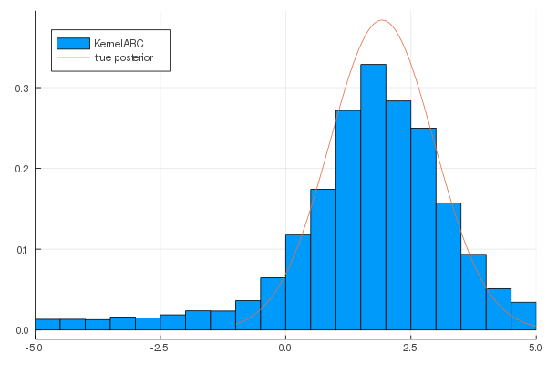

# LikelihoodfreeInference.jl

<!--


 -->
<!--[](https://travis-ci.com/jbrea/LikelihoodfreeInference.jl)
[](http://codecov.io/github/jbrea/LikelihoodfreeInference.jl?branch=master)
[](https://jbrea.github.io/LikelihoodfreeInference.jl/stable)-->
[](https://juliaapproxinference.github.io/LikelihoodfreeInference.jl/dev)

Given some measured data `y0` and a potentially stochastic model `model(x)`
that takes parameters `x` and returns simulated data `y`,
`LikelihoodfreeInference.jl` allows to find approximate posterior distributions
over `x` or approximate maximum likelihood (ML) and maximum a posteriori (MAP)
point estimates, by runnning
```julia
run!(method, model, y0)
```
where `method` can be an Approximate Bayesian Computation (ABC) method
`PMC`, `AdaptiveSMC`, `K2ABC`, `KernelABC`
(`subtypes(LikelihoodfreeInference.AbstractABC)`) or
`PointEstimator`, `KernelRecursiveABC`
(`subtypes(LikelihoodfreeInference.AbstractPointABC)`).

## Example

```julia
using LikelihoodfreeInference, StatsPlots, Distributions
model(x) = randn() .+ x
data = [2.]
method = KernelABC(delta = eps(),
                   K = 10^4,
                   kernel = Kernel(),
                   prior = TruncatedMultivariateNormal([0.], [5.],
                                                       lower = [-5.],
                                                       upper = [5.]))
result = run!(method, model, data)
println("Approximate posterior mean = $(mean(method))")
figure = histogram(method, normalize = true, xlims = (-5, 5))
plot!(figure, -1:.01:5, pdf.(Normal.(-1:.01:5, 26/25), 25/26*2.0))
```


See [documentation](https://juliaapproxinference.github.io/LikelihoodfreeInference.jl/dev)
or example notebooks [Gaussian model](https://github.com/jbrea/LikelihoodfreeInference.jl/blob/gh-pages/dev/generated/toyexample.ipynb) and [Blowfly model](https://github.com/jbrea/LikelihoodfreeInference.jl/blob/gh-pages/dev/generated/blowfly.ipynb).
